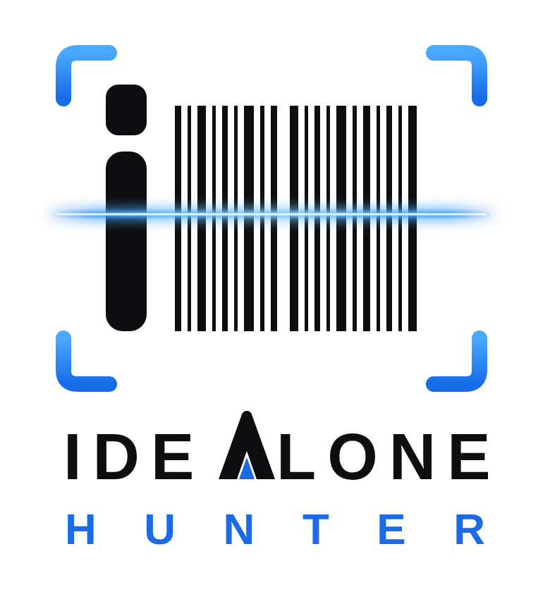

# IdealOne.Hunter



**AI lead intelligence, sold as a standalone suite in the IdealOne family of apps.**

IdealOne.Hunter discovers companies showing credible, recent buying signals, verifies them against real sources, scores commercial fit, finds publicly listed decision-makers, and drafts personalised outreach — then holds everything in a human approval queue. **Nothing is ever sent automatically.**

It runs on its own database and scheduler and requires no other IdealOne app. Integration with IdealOne.CRM (converting qualified leads into CRM accounts) is an optional add-on, not a dependency.

**Multi-tenant / resellable.** One deployment serves many customer organisations. Each org signs up in the web app and fills a **lead wishlist** (target market, industries, buying signals, what they sell, leads/day). The pipeline reads every org's wishlist, templates it into the five system prompts, and writes leads into that org's own table — so a single scheduled run serves all customers at once. The owner org ships pre-configured and bypasses onboarding.

## What's in this package

| File | Purpose |
|---|---|
| `idealone-hunter-spec.md` | Implementation Specification v1.0 — pipeline design, signal taxonomy, schema, dedupe rules, dashboard, ops |
| `lead_agent.py` | Multi-tenant pipeline runner (Scout → Verifier → Analyst → Contact Researcher → Outreach Writer); sweeps every onboarded org |
| `store.py` | Shared document store — reads/writes the SAME data the CRM web app uses (Postgres via `DATABASE_URL`, JSON files otherwise) |
| `prompts.json` | The five subagent system prompts as **templates** (`{ORG_NAME}`, `{MARKET}`, `{INDUSTRIES}`, `{SIGNALS}`, `{SERVICES}`, `{NOTES}`, `{MAX_CANDIDATES}`) filled from each org's wishlist |
| `requirements.txt` | Python dependencies |
| `assets/logo.svg`, `assets/logo.png` | IdealOne.Hunter brand lockup (vector + raster) |

The prompts are customer-agnostic templates. A customer is configured entirely by their wishlist (captured in the web app during signup) — no code or prompt edits per customer.

## Quick start

```bash
pip install -r requirements.txt
export DATABASE_URL=postgres://...   # same DB as the web app; omit to use JSON files
export ANTHROPIC_API_KEY=...         # required (unless --dry-run)
export APOLLO_API_KEY=...            # optional; contact research degrades gracefully without it

python lead_agent.py run             # sweep every onboarded org, capped at each org's leads/day
python lead_agent.py run --org <id>  # one organisation only
python lead_agent.py run --dry-run   # no API calls; stubbed candidates to prove the read/write wiring
```

Schedule with cron for weekday-morning runs: `0 8 * * 1-5`. One run serves every customer org; results land in each org's approval queue in the web app.

## Hard rules (enforced in the pipeline, not just the prompts)

1. No email is ever dispatched without a human approving it. The pipeline may only write `Verified` / `High Priority` leads into the approval queue; every status after that is human-set in the UI.
2. No lead is written without at least one evidence URL and a verifiable date.
3. Contact fields are only populated from Apollo API responses or fetched public pages — never from model free-text.
4. Leads are org-scoped. Proprietary sourcing (Apollo/LinkedIn provenance) is stripped for tenant orgs by the web app and replaced with a green “Verified · N sources” badge; only the owner org sees provenance.

See `idealone-hunter-spec.md` for the full design.
